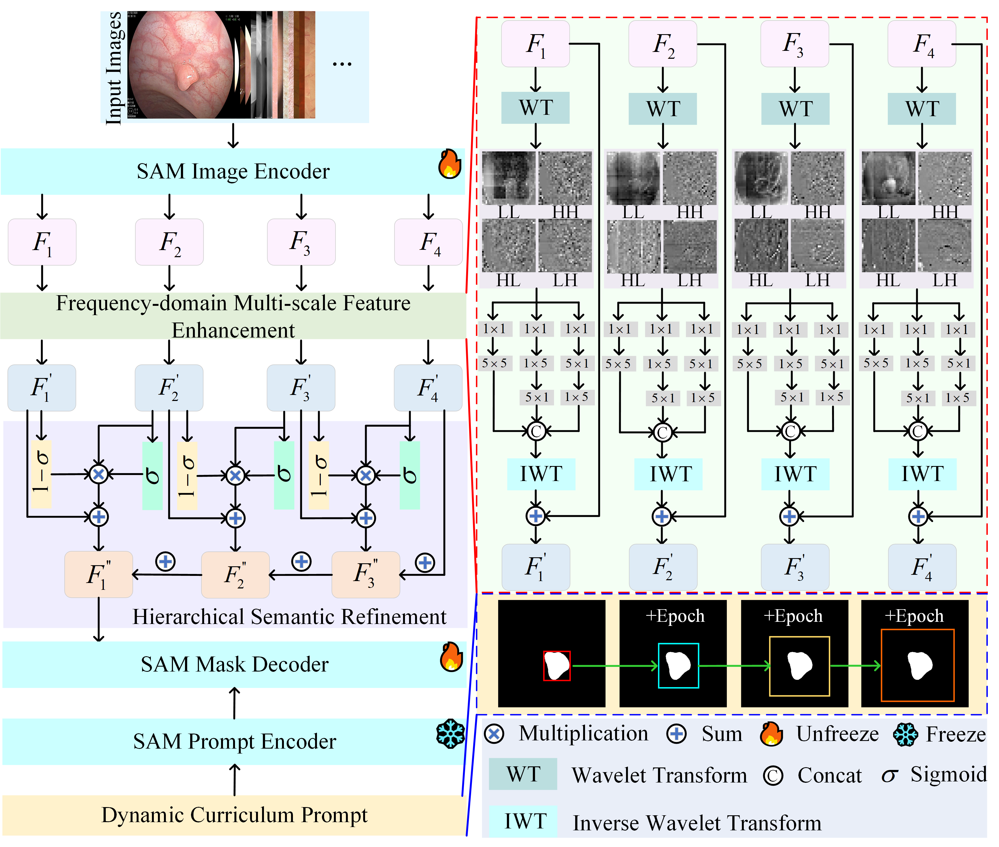

# :page_facing_up: AdaptSAM: Adaptive SAM for Cross-Domain Few-Shot Medical Image Segmentation

<p align="center"></p>

### Dependency Preparation

```shell
cd AdaptSAM
# Python Preparation
conda create -n AdaptSAM python=3.10
activate AdaptSAM
# It is recommended to use the conda installation on the Pytorch website https://pytorch.org/
pip install -r requirements.txt
```

### Model Training

```shell
# Model Train
# Please set the path of training image, training label in Train.py file.
python Train.py
```

### Citation ✏️ 📄

If you find this repo useful for your research, please consider citing the paper as follows:

```
The paper has not yet been accepted.
```
